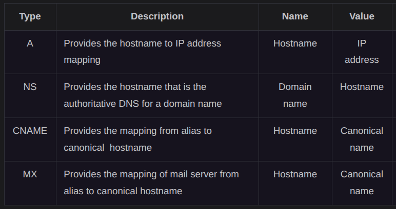
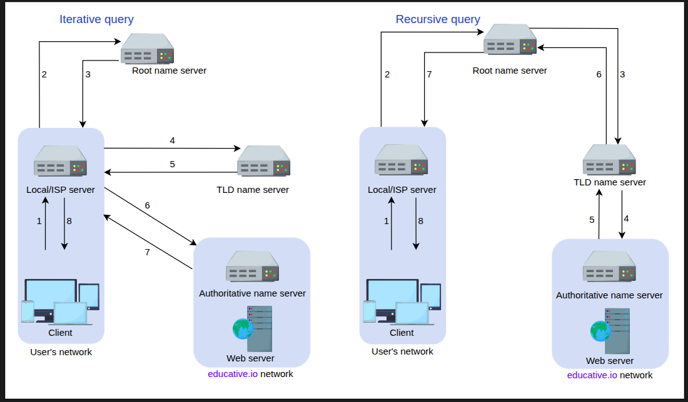

# Domain Name System(DNS)

- Computers are uniquely identified by IP addresses.
- As humans we cannot remember the IP address. Hence, a domain name is mapped to IP addresses. Like `google.com`.
- Domain Name System(DNS) is the internet's naming service that maps human-friendly domain names to machine-readable IP addresses.
- When a user enters a domain name in the browser, the browser has to translate the doS infrastructure. Once the desired IP address is obtained, the user's request is forwarded to the destination web server.
- Consider a case, two users enter the same domain name at the same time. How DNS ensure both reach the correct server? DNS is a distributed system with multiple servers that resolve domain names independently. It ensures consistency by directing both user records. THis way, even if two users enter the same domain name at the same time, they will both reach the correct server without any conflict.
- **Name Servers:** DNS isn't a sinlge server. It's a complete infrastructure with numerous servers. DNS servers that respond to users' queries are called *name servers*
- **Resource records:** The DNS database stores domain name to IP address mappings in the form of resource records (RR). The RR is the smallest unit of information that users request from the name servers. There are different types of RRs.

- **Caching:** DNS uses caching at different layers to reduce request latency for the user. Caching reduces the burden on DNS infrastructure.
- **Hierarchy:** DNS name servers are in a hierarchical form. The hierarchical structure allows DNS to be highly scalable because of its increasing size and query load.

## Working of Domain Name System

### DNS Hierarchy

4 Main types of servers in the DNS hierarchy:

- **DNS Resolver:** Resolvers initiate the querying sequence and forward requests to the other DNS name servers. Typically, DNS resolvers lie within the premise of the user's network. However, DNS resolvers can also cater to users' DNS queries through caching techniques. These servers can also be called local or default servers.
- **Root-level name servers:** These servers receive requests from local servers. Root name servers maintain name servers based on top-level domain names, such as .com, .edu, .us, and so on. For instance, when a user requests the IP address of `google.com`, root-level name servers will return a list of top-level domain (TLD) servers that hold the IP addresses of the .com domain.
- **Top-Level domain (TLD) name servers:** These servers hold the IP addresses of authoritative name servers. The querying party will get a list of IP addresses that belong to the authoritative servers of the organization.
- **Authoritative name servers:** These are the organization’s DNS name servers that provide the IP addresses of the web or application servers.

### Query Resolution

1. **Iterative:** The local server requests the root, TLD, and the authoritative servers for the IP address.
- **Recursive:** The end user requests the local server. The local server further requests the root DNS name servers. The root name servers forward the requests to other name servers.

### Caching

- Caching refers to the temporary storage of frequently requested resource records. 
- A record is a data unit within the DNS database that shows a name-to-value binding. 
- Caching reduces response time to the user and decreases network traffic. 
- When we use caching at different hierarchies, it can reduce a lot of querying burden on the DNS infrastructure. 
- Caching can be implemented in the browser, operating systems, local name server within the user’s network, or the ISP’s DNS resolvers.

## DNS as a distributed system

DNS as a distributed system itself provides following advantages:

- It avoids becoming a single point of failure (SPOF).
- It achieves low query latency so users can get responses from nearby servers.
- It gets a higher degree of flexibility during maintenance and updates or upgrades. For example, if one DNS server is down or overburdened, another DNS server can respond to user queries.
- There are 13 logical root name servers (named letter A through M) with many instances spread throughout the globe. These servers are managed by 12 different organizations.

### Highly Scalable

- Due to its hierarchical nature, DNS is a highly scalable system.
- Roughly 1,000 replicated instances of 13 root-level servers are spread throughout the world strategically to handle user queries.
- The working labor is divided among TLD and root servers to handle a query and, finally, the authoritative servers that are managed by the organizations themselves to make the entire system work.
- Different services handle different portions of the tree enabling scalability and manageability of the system.

### Reliable

- **Caching:** The caching is done in the browser, the operating system, and the local name server, and the ISP DNS resolvers also maintain a rich cache of frequently visited services. Even if some DNS servers are temporarily down, cached records can be served to make DNS a reliable system.
- **Server replication:** DNS has replicated copies of each logical server spread systematically across the globe to entertain user requests at low latency. The redundant servers improve the reliability of the overall system.
- **Protocol:** Although many clients rely on the unreliable User Datagram Protocol (UDP) to request and receive DNS responses, it’s important to acknowledge that UDP also offers distinct advantages. It is much faster, and therefore, improves DNS performance. Furthermore, internet service reliability has improved since its inception, so UDP is usually favored over TCP. DNS queries are usually retransmitted at the transport layer if there’s no response for the previous one. Therefore, request-response might need additional round trips, which provides a shorter delay as compared to TCP, which needs a three-way handshake every time before data exchange.

*DNS usually relies on UDP for quick, lightweight queries. However, when networks are congested or responses exceed 512 bytes, DNS switches to TCP for reliable delivery. TCP is also used for zone transfers, where consistent and complete data exchange between DNS servers is required. Modern clients may use DNS over HTTPS (DoH) or DNS over TLS (DoT) for added security and privacy.*

### Consistent

- DNS uses various protocols to update and transfer information among replicated servers in a hierarchy. 
- DNS compromises on strong consistency to achieve high performance because data is read frequently from DNS databases as compared to writing. 
- However, DNS provides eventual consistency and updates records on replicated servers lazily. 
- Typically, it can take from a few seconds up to three days to update records on the DNS servers across the Internet. 
- The time it takes to propagate information among different DNS clusters depends on the DNS infrastructure, the size of the update, and which part of the DNS tree is being updated.
- Consistency can suffer because of caching too. 
- Since authoritative servers are located within the organization, it may be possible that certain resource records are updated on the authoritative servers in case of server failures at the organization. 
- Therefore, cached records at the default/local and ISP servers may be outdated. To mitigate this issue, each cached record comes with an expiration time called time-to-live (TTL).