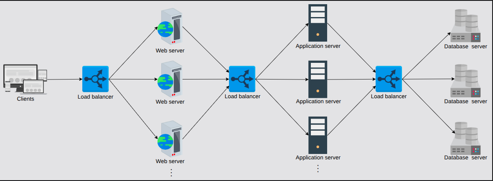

# Load Balancers

- A Load balancer divides all clients' requests among the pool of available servers. It does so to avoid overloading or crashing servers.
- A Load balancing layer is the first point of contact within a data center after the firewall. A Load balancer may not be required if a service entertains a few hundred or even a few thousand requests per second.
- Load balancers provide following capabilities:
    - **Scalability:** Load balancers make upscaling or downscaling servers.
    - **Availability:** EVen if some servers go down or suffer a fault, the system still remains available. One of the jobs of the load balancers is to hide faults and failures of servers.
    - **Performance:** Load balancers can forward requests to servers with a lesser load so the user can get a quicker response time. This not only improves performance but also improves resource utilization.
- The requests received by a load balancer are distrivuted among multiple servers using a configured algorithm:
    - Round-Robin
    - Weighted Round-Robin
    - Least response time
    - Least connections
- LBs sit between clients and servers. Requests go through to servers and back to clients via the load-balancing layer.
- However, LBs can also be used between server instance of below three services:
    - Place LBs between end users of the application and web servers/application gateway.
    - Place LBs between the web servers and application servers that run the business/application logic.
    - Place LBs between the application servers and database servers.
    

## Services offered by Load Balancers

- **Health Checking:** Heartbeat protocol is a way of identifying failures in distributed systems. Using this protocol, every node in a cluster periodically reports its health to a monitoring space.
- **TLS Termination:** LBs reduce the burden on end-servers by handling TLS termination with the client.
- **Predictive Analytics:** LBs can predict traffic patterns through analytics performed over traffic passing through them or using statistics of traffic obtained over time.
- **Reduced human intervention:** Because of LB automation, reduced system administration efforts are required in handling failures.
- **Service discovery:** An advantage of LBs is that the clients' requests are forwarded to appropriate hosting servers by inquiring about the *Service registry*. Service registry is a repository of the srvices and the instances available against each service.
- **Security:** LBs may also improve security by mitigating attacks like *denial-of-service (DoS)* at different layers of the OSI Model. *Denial-of-Service* is an attack where a client floods the server with traffic to exhaust the server's resources such that it is unable to process a legitimate user's request.

*Load Balancers provide flexibility, reliability, redundancy and efficiency to the overall design of the system.*

## Global and Local Load Balancing

