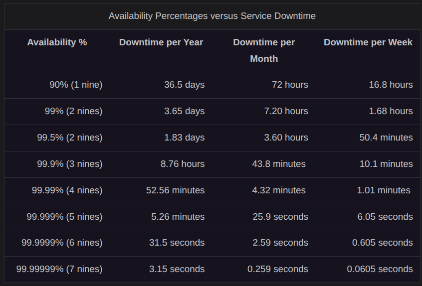
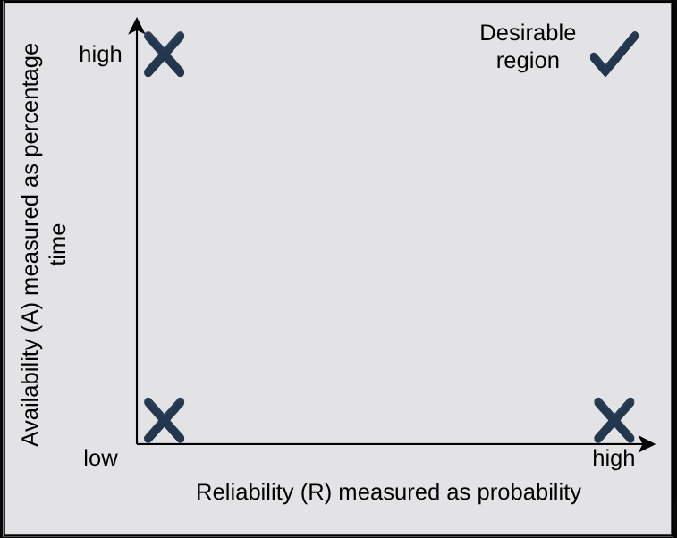

# Non-Functional Requirement in System Design

## Availability

- Percentage of time that some service or infrastructure is accessible to clients and is operated upon under normal conditions.
- If a service has 100% availability, it means that the said service functions and responds as intended (operates) all the time.
- $A = \frac{TotalTime - AmountOfTimeServiceWasDown}{TotalTime} X 100$
- Availability is measured as number of nines. 

## Reliability

- Probability that the service will perform its functions for a specified time.
- Measures how the service performs under varying operating conditions.
- **Mean Time Between Failures(MTBF)** and **Mean Time To Repair(MTTR)** are used as metrics to measure reliability.
- $MTBF = \frac{TotalElapsedTime - SumOfDowntime}{TotalNumberOfFailures}$
- $MTTR = \frac{TotalMaintenanceTime}{TotalNumberOfRepairs}$
- We strive for higher MTBF Value and Lower MTTR value.
- Reliability focusses on how consistently a service operates without failure, availability considers how often it is accessible when needed.

**A Service-Level Objective (SLO) is a key element of a Service-Level Agreement (SLA) between a service provider and a customer. SLOs are agreed upon as a means of measuring the performance of the Service Provider and are outlined as way of avoiding disputes between the two parties based on misunderstanding.**

- The measurement of availability is drive by time loss, whereas the frequency and impact of failures drive the measure of reliability.

- low A, low R; low A, high R; high A, low R; high A, high R(desirable)

## Scalability

- System's ability to handle an increasing workload or a growing number of users without compromising performance.
- A Scalable system can grow to meet demand while maintaining responsiveness and reliability as more users, data, or features are added.
- The Workload of a system can vary by type:
    - **Request workload:** The number of requests served by the system.
    - **Data or storage workload:** The amount of data stored, processed, or retrieved by the system.

### Dimensions of Scalability

- **Size Scalability:** The ability to add users or resources easily without redesigning the system.
- **Administrative Scalability:** The capacity for a growing number of users or organizations to share the same distributed system efficiently.
- **Geographical Scalability:** The ability of the system to maintain acceptable performance across regions as it expands geographically.

### Why Scalability?

- **Anticipating future growth**
- **Boosting System Performance**
- **Ensuring Availability**
- **Expansion to new regions**
- **Feature Expansion**
- **Integrating third-party services**

### Approaches for Scalability

#### Vertical Scalability (Scaling Up)

- Upgrading the hardware resources of an existing system to handle increasing load.
- Includes more CPU cores, RAM, or storage capacity to boost performance.
- It allows teams to expand their current hardware or software capacity but only up to the limits of a sinlge server.
- Simpler to implement and manage compared to other approaches.
- Scalability is limited by the maximum capacity of a single machine and upgrades may cause temporary downtime. High-performance components tend to be expensive, which increases overall costs.

#### Horizontal Scalability (Scaling out)

- It involves adding more machines to the network to distribute the workload across multiple servers.
- Additional servers are deployed to share the processing load. It offers higher scalability, better fault tolerance, and improved reliability as failures in one machine do not impact the rest of the system.
- It is more cost-efficient as commodity hardware instead of specialized high-end machines.
- Horizontal scaling introduces added complexity as managing and maintaining a distributed system is more difficult. Communication between servers may also increase latency; the application architecture must support distributed operations to ensure effective scaling.
- Horizontal scaling is suitable for systems that expect rapid growth or fluctuating workloads, requiring flexibility and elasticity.
- *Autoscaling automatically adjusts the number of resources allocated to a system in response to real-time demand. It continuously monitors metrics such as CPU usage, network traffic, or queue length and dynamically adds or removes resources to maintain optimal performance.*

### Scalability Techniques

- **Load Balancing:** User traffic is evenly distributed among the available servers, preventing any single server from being overloaded. In this way, the system can handle increased load as no single server is overwhelmed and fails.
- **Caching and Content Delivery Networks (CDNs):** Caching stores commonly accessed data in temporary storage, reducing the need for repeated requests to the database. Additionally, distributing static content, such as videos and images, through CDNs close to users further reduces the system's load.
- **Data replication and sharding:** Data replication duplicates data across multiple servers to enhance scalability and fault tolerance, while sharding divides data into smaller partitions across databases to improve performance and scalability.
- **Microservices Architecture:** Microservices Architecture improves scalability by breaking down applications into smaller, independent services that can be handled or managed independently. It also allows each service to scale independently according to demand, without affecting the performance of other services.

### Practices for Scalability

- **Mitigating performance bottlenecks:**
    - Analyze and determine the performance bottlenecks in the system. These can be caused by factors such as inefficient database queries and algorithms. Identifying and mitigating such bottlenecks is essential to ensure scalability.
- **Efficient resource utilization:**
    - Available resources should be utilized efficiently. Implement a queuing mechanism to process incoming requests and use worker servers to handle background tasks independently. Effective caching can also help improve system efficiency.
- **Improving data storage and access:**
    - How data is stored and accessed also impacts scalability. Scalable and distributed storage, caching, efficient data access patterns, indexing, data replication, and partitioning can help improve scalability.
- **Choosing the right and modern technologies:**
    - Selecting the right technologies is a significant advantage for scalability. For e.g. selecting the most efficient algorithm, optimizing database queries, and choosing SSD over HDD can have a significant impact on the system.

### Scalability Challenges and Trade-offs

- **Cost:** To scale a system, we often need to add more resources, which can directly increase its cost. This can be a direct trade-off to achieve scalability.
- **Consistency:** Maintaining data consistency becomes increasingly difficult across distributed systems as they scale.
- **Security:** Ensuring consistent security policies across services and data becomes challenging as the system grows.
- **Complexity:** Systems become more complex to manage and troubleshoot as we scale.

### Scalability Real-World Examples

- **Google Search:** Built on a massively scalable architecture that processes billions of queries daily.
- **Netflix:** Utilizes cloud-based infrastructure (Amazon Web Services) to handle millions of concurrent requests and deliver seamless streaming to users.
- **Facebook:** A highly scalable system that handles requests and data from millions of users the globe.
- **Uber:** Designed to handle millions of ride requests globally.

## Maintainability

- One of the main tasks after building a system is to keep the system up and running by finding and fixing bugs, adding new functionalities, keeping the system's platform updated, and ensuring smooth system operation. A Salient feature to define such requirements is *maintainability*.
    - **Operability**: Ease with which we can ensure the system's smooth operational running under normal circumstances and achieve normal conditions under a fault.
    - **Lucidity:** Refers to the simplicity of the code. The simpler the code base, the easier it is to understand and maintain it and vice versa.
    - **Modifiability:** Capability of the system to integrate modified, new and unforeseen features without any hassle.
- M is the probability that the service will restore its functions within a specified time of fault tolerance. It measures how conveniently and swiftly regains its normal operating conditions.
- Mean Time to Repair: $MTTR = \frac{TotalMaintenanceTime}{TotalNumberOfRepairs}$

## Fault Tolerance

- It refers to a system's ability to execute persistently even if one or more of its components fail. Components can be software or hardware.
- Two key qualities make fault tolerance essential: availability and reliability.
- Fault-Tolerant Approaches:
    - **Fault-Removal:** It can be either forward error recovery or backward error recovery.
    - **Fault-Masking:** When presence of one defect hides the presence of another defect in the system.