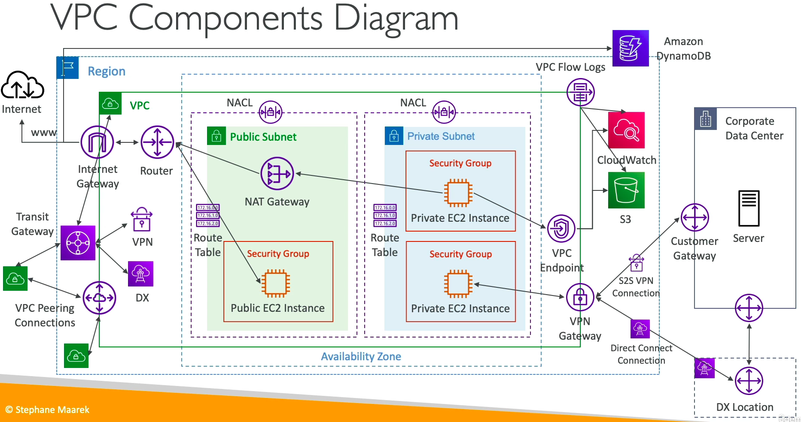

# Virtual Private Cloud

## Understanding CIDR

- Classless Inter-Domain Routing - a method for allocating IP addresses.
- Used in Security Groups rules and AWS networking in general.
- They help to define an IP address range:
    - `WW.XX.YY.ZZ/32` => one IP
    - `0.0.0.0/0` => all IPs
    - We can define: 192.168.0.0/26 => 192.168.0.0 - 192.168.0.63 (64 IP addresses)
- A CIDR consist of two components
    - **Base IP:** Represents an IP contained in the range(XX.XX.XX.XX) e.g. `10.0.0.0`, `192.168.0.0`
    - **Subnet Mask:** Defines how many bits can change in the IP. Can take two forms: `/8 <=> 255.0.0.0`, `/16 <=> 255.255.0.0`, `/24 <=> 255.255.255.0`
- The Subnet Mask basically allows part of of the underlying IP to get additional next values from the base IP. 
- Question: What is `192.168.0.0/24`?
- Question: What is `134.56.78.123/32`?

## Public Vs Private IPv4

- The Internet Assigned Numbers Authority (IANA) established certain blocks of IPv4 addresses for the use of private (LAN) and public (Internet) addresses.